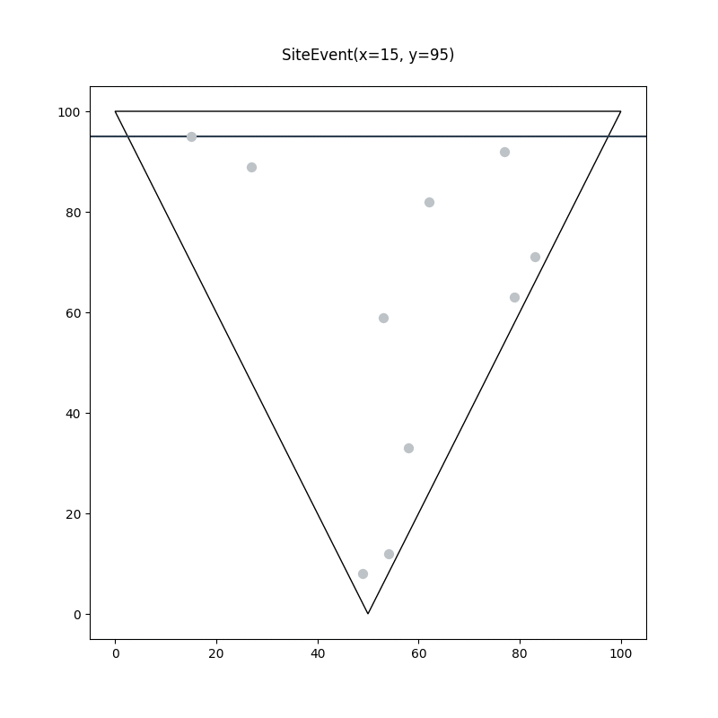

# Voronoi
[](https://travis-ci.org/Yatoom/voronoi)



A Python implementation of Fortune's algorithm based on the description of "Computational Geometry: Algorithms and Applications" by de Berg et al. The algorithm handles the special cases described in the book. The bounding box is generalized to handle a convex polygon.

## Manual Installation

First, clone the repository and then install the package.
```bash
git clone https://github.com/Yatoom/voronoi.git
cd voronoi
python setup.py install
```
Note: you need to use `sudo python3 setup.py install` on most Linux distributions.

## Example usage

Example that uses a polygon as a bounding box.

```python3
from voronoi import Voronoi, Polygon, Visualizer, VoronoiObserver

# Define some points (a.k.a sites or cell points)
points = [
    (2.5, 2.5),
    (4, 7.5),
    (7.5, 2.5),
    (6, 7.5),
    (4, 4),
    (3, 3),
    (6, 3),
]

# Define a bounding box / polygon
polygon = Polygon([
    (2.5, 10),
    (5, 10),
    (10, 5),
    (10, 2.5),
    (5, 0),
    (2.5, 0),
    (0, 2.5),
    (0, 5),
])

# Initialize the algorithm
v = Voronoi(polygon)

# Attach a Voronoi Observer that monitors and visualizes the construction of 
# the Voronoi Diagram step-by-step
v.attach_observer(VoronoiObserver(visualize_steps=True))

# Create the diagram
v.create_diagram(points=points)

# Get properties
edges = v.edges
vertices = v.vertices
arcs = v.arcs
points = v.points

# Plotting
Visualizer(voronoi, canvas_offset=1)\
    .plot_sites(show_labels=True)\
    .plot_edges(show_labels=False)\
    .plot_vertices()\
    .plot_border_to_site()\ # Indicates with dashed line to which site a border belongs
    .show()

```


### Calculate the shell size for each point
```python
for point in v.sites:
    print(f"{(point.x, point.y)} \t {point.cell_size()}")
```
Output:
```
(2.5, 2.5) 	 11.529761904761905
(4, 7.5) 	 15.064062500000006
(7.5, 2.5) 	 11.75
(6, 7.5) 	 10.520833333333329
(4, 4) 	     7.640625
(3, 3) 	     5.946354166666666
(6, 3) 	     9.423363095238095
```

More examples can be found in the `voronoi/examples` folder.

### Get coordinates of the cell borders for a point
```python
v.sites[0].get_coordinates()
```
Output:
```python
[(0.167, 5.333), (4.5, 1.0), (4.643, 0.0), (2.5, 0), (0, 2.5), (0, 5)]
```

## Testing
To run unit tests, run the following comand.
```
python3 -m "nose" voronoi/tests/unit.py
```
